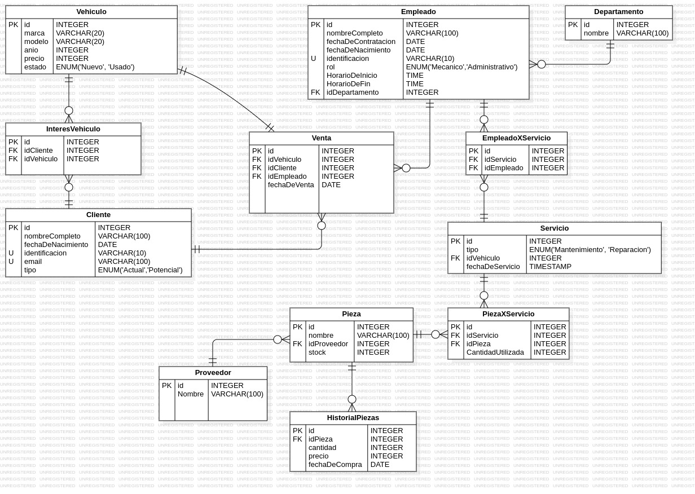

<div align="center">
<h1 text-align="center">Concesionario</h1>
</div>

<div align="center">
  <a href="">
    
  </a>
<h1 text-align="center">Diagrama De la Base De Datos</h1>
</div>
  
## Tabla de Contenidos 🔗
1. [Información General](#información-general-)
2. [Tecnologías](#tecnologías-)
3. [Instalación](#instalación-)
4. [Cómo Aportar](#como-aportar-)
5. [Autor](#autor-)

## Información General 📒
En este projecto se ejercito la construccion de bases de datos y las querys, el projecto fue trabajado en Postgresql y en un limite de tiempo de 4 Horas

## Tecnologías 🤖
Tecnologías usadas en este proyecto:
- Postgresql
- Dbeaver

## Instalación 📦
```bash
git clone https://github.com/JuanJTorresB/Examen_PostgreSQL_TorresJuan.git
```
1. Ejecuta el archivo DDL en Dbeaver en una conexion Postgresql

2. Ejecuta las Inserciones

3. Por ultimo ejecuta las consultas

## Como Aportar 🛠
***
> Creando nuevas realaciones

> Creando Nuevas Consultas

## Autor 🐦‍🔥
***
### Juan José Torres Becerra